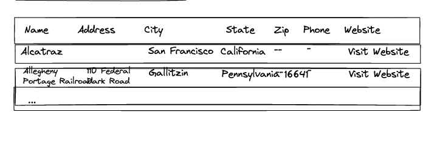
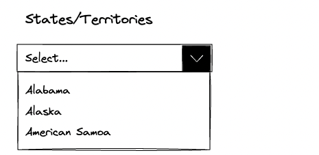
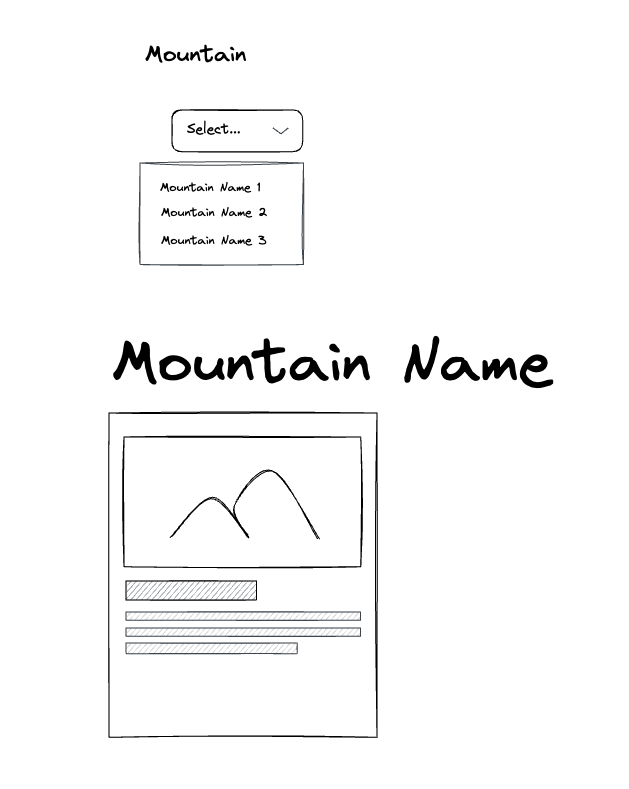

# Capstone Tips

## Parks Page

1. Load parksArray into parks table.

- Use [lotterytickets](../exercises/lotterytickets/) as an example.
- Could also use PeopleList as an example.

2. Load locationsArray into a select list (dropdown) with Label of State/Territory.

- Use [select list from array](https://github.com/craigmckeachie/fall2023-workbook4/blob/main/demos/3-4-select-list-from-array.html) as example

3. When States list changes filter the parks table by the state.

- Use [tourist bureau workshop](https://github.com/craigmckeachie/fall2023-workbook4/blob/main/workshop/tourist-bureau/activities.html) as an example. The categories in the workshop are the states on the park page. The activities in the workshop are the parks on the parks page ...what is different is parks are loaded into a table whereas your activities were loaded into a dropdown.

## Mountains Page

4. Complete the mountains page.
   

- Use [Football Teams as an example](https://github.com/craigmckeachie/fall2023-workbook4/tree/main/exercises/Football)

## Parks Page Part 2

5. Load parkTypesArray into another select list (dropdown) with Label of Park Type.

- Use [select list from array](https://github.com/craigmckeachie/fall2023-workbook4/blob/main/demos/3-4-select-list-from-array.html) as example.

6. When Park Type list changes filter the parks table by park type

- Use your code from step 3 above but change your if statement to filter by Park Type instead of location/state.

7. Add radio buttons in a group for the search type (By Location or By Type). Hide and show the appropriate `select list\dropdown` when the page loads and when the search type selected changes.
- Use the [Hide/Show Radio Demo](../demos/hide-show-radio.html) as an example.

## Other

7. Be sure you have consistent navigation between all your pages
8. Add a classless library style sheet of your choice.

- Use [this article](https://blog.logrocket.com/comparing-classless-css-frameworks/) to understand how to try out different ones.
